# Data Loading Patterns in React Router SSR Application

**Type:** Architecture Diagram
**Last Updated:** 2025-11-12
**Related Files:**
- `app/routes.ts` - Route definitions
- `app/routes/home.tsx` - List loader implementation
- `app/routes/pokemon.$id.tsx` - Detail loader implementation
- `app/routes/api.evolutions.$id.tsx` - API endpoint for evolution chains
- `app/services/pokemon.service.ts` - Centralized API service
- `app/components/pokemon-card.tsx` - Image loading state management
- `app/components/pokemon-evolutions.tsx` - Client-side fetching with `useFetcher`
- `react-router.config.ts` - SSR configuration

## Purpose

Shows how this application loads data across server-side routes, client-side transitions, and lazy-loaded features, ensuring users see fast initial page loads and progressive enhancements while images and optional data streams in.

## Diagram

```mermaid
graph TD
    subgraph "Front-Stage (User Experience)"
        direction TB
        User1[User Lands on Home] --> InitialView["Page Renders with Data ⚡ SSR instant load"]
        User2[User Clicks Pokemon] --> Nav["Navigation Transitions 🎯 View transition API"]
        User3[User Views Details] --> ImgLoad["Images Stream In ⏱️ Progressive reveal"]
        InitialView --> PaginatePage["Pagination via URL ⚡ Instant list updates"]
        Nav --> DetailView["Detail Page SSR ⚡ Server-rendered"]
        DetailView --> Evolution["Evolution Chain Loads ⏱️ Non-blocking after page"]
        ImgLoad --> Success["Complete View ✅"]
        Evolution --> Success
    end

    subgraph "Back-Stage (Implementation)"
        direction TB

        subgraph "Server-Side Rendering (SSR)"
            direction TB
            ListLoader["List Loader<br/>getPokemonList ⚡ <100ms PokeAPI"]
            DetailLoader["Detail Loader<br/>getPokemonById 🛡️ Type-safe extraction"]
            MetaMaker["Dynamic Meta Tags<br/>Pokemon details 📊 SEO optimized"]
            Cache1["HTTP Cache Headers<br/>300s client, 3600s CDN 💾"]
        end

        subgraph "Client-Side Navigation"
            direction TB
            ViewTrans["View Transition API<br/>useViewTransitionState ⏱️ Smooth transitions"]
            Serialize["Data Deserialization<br/>useLoaderData 📊 Server data available"]
        end

        subgraph "Lazy Client-Side Loading"
            direction TB
            Fetcher["useFetcher Hook<br/>Evolution chains ⏱️ Non-blocking load"]
            EvolutionAPI["API Route Handler<br/>api.evolutions.$id 🔄 Graceful errors"]
            ParseChain["Parse Evolution Tree<br/>Recursive traversal 🎯 Complex data handling"]
        end

        subgraph "Image Loading Pipeline"
            direction TB
            ImageLoad["Image onLoad Tracking<br/>Per-item state ⏱️ Progressive reveal"]
            Fallback["Fallback Sources<br/>official-artwork → front_default 🔄"]
            Skeleton["Shimmer Animation<br/>pulse + gradient ✅ Perceived speed"]
        end

        subgraph "Error Handling & Resilience"
            direction TB
            PokeAPI["PokeAPI Service<br/>Centralized calls 🛡️ Single source of truth"]
            ErrorBound["Error Boundary<br/>Global 404/500 handling 🔄 Graceful degradation"]
            EvolutionFallback["Evolution Errors<br/>Returns [] instead of throwing 🔄"]
        end
    end

    ListLoader --> User1
    DetailLoader --> User2
    MetaMaker --> DetailView
    Cache1 --> ListLoader
    Cache1 --> DetailLoader

    User1 --> InitialView
    User2 --> Nav
    DetailView --> DetailLoader

    ViewTrans --> Nav
    Serialize --> DetailView

    Nav --> DetailView
    DetailView --> Fetcher
    Fetcher --> EvolutionAPI
    EvolutionAPI --> ParseChain
    EvolutionFallback --> Evolution
    ParseChain --> Evolution

    DetailView --> ImageLoad
    ImageLoad --> Fallback
    Fallback --> Skeleton
    Skeleton --> ImgLoad

    PokeAPI --> ListLoader
    PokeAPI --> DetailLoader
    ErrorBound --> User1
    ErrorBound --> User2

    Success --> User3
    InitialView --> User3
    Evolution --> Evolution
    ImgLoad --> ImgLoad
```

## Key Insights

### Server-Side Data Loading (SSR)
- **Instant Initial Load**: Loaders execute on server before render, ensuring users never see spinners on first page load. PokeAPI calls complete in <100ms.
- **Type Safety**: Route-specific `+types` imports provide compile-time type checking for loader arguments and return values.
- **Caching Strategy**: HTTP cache headers (300s client, 3600s-1 day CDN) reduce API calls for popular Pokemon while keeping fresh data available.

### Progressive Client-Side Loading
- **Non-Blocking Evolution Data**: `useFetcher` loads evolution chains after initial page render, preventing page jank. If it fails, users still see the Pokemon detail page.
- **Image Progressive Reveal**: Images fade in as they load via `onLoad` callbacks. Skeletons with shimmer animation maintain perceived speed while images stream from CDN.
- **View Transitions**: React Router's view transition API provides smooth visual transitions between detail pages, enhancing perceived responsiveness.

### Error Resilience
- **Graceful Degradation**: Evolution chain failures return empty array instead of breaking the page. Missing images show fallback sprite or "No image" message.
- **Global Error Boundary**: 404 and 500 errors caught server-side, with proper HTTP status codes for SEO.
- **Selective Data Extraction**: Service layer only fetches fields needed for each view, reducing payload size and API response time.

### Data Flow Optimization Opportunities
- **Sequential Evolution Fetching**: Currently fetches species → chain ID → chain recursively. Could parallelize first two calls with `Promise.all()`.
- **Application-Level Caching**: No in-memory cache for repeat visits to same Pokemon. Could add client-side cache to avoid re-fetching after user navigates away and back.
- **Image Prefetching**: No prefetch on hover. Could load detail page images during navigation delay to reduce perceived load time.
- **Deferred SSR Data**: Evolution chains could use `defer()` to stream them after initial HTML if user needs them immediately.

## Change History

- **2025-11-12:** Initial creation documenting SSR flow, lazy loading patterns, and optimization opportunities
